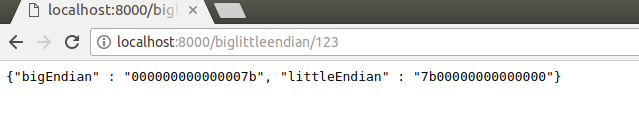

# restBigLittleEndian
golang REST api for converting number to big endian and little endian binary numbers

number can be given as a parameter at url and a json response of big and little endian binary numbers return

An example usage ; number given after /biglittleendian/{number} and response return as json

also can be used in terminal with command "curl  http://localhost:8000/biglittleendian/123"
